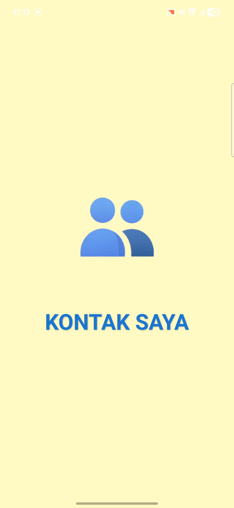
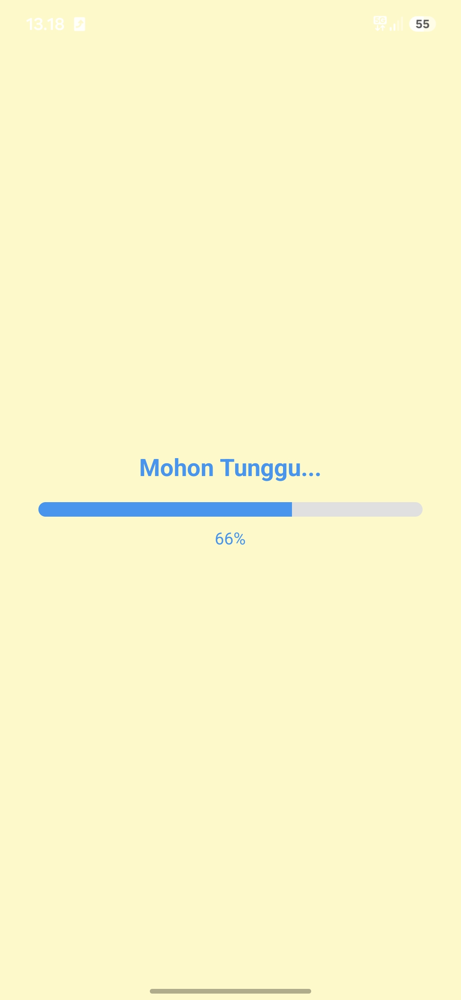
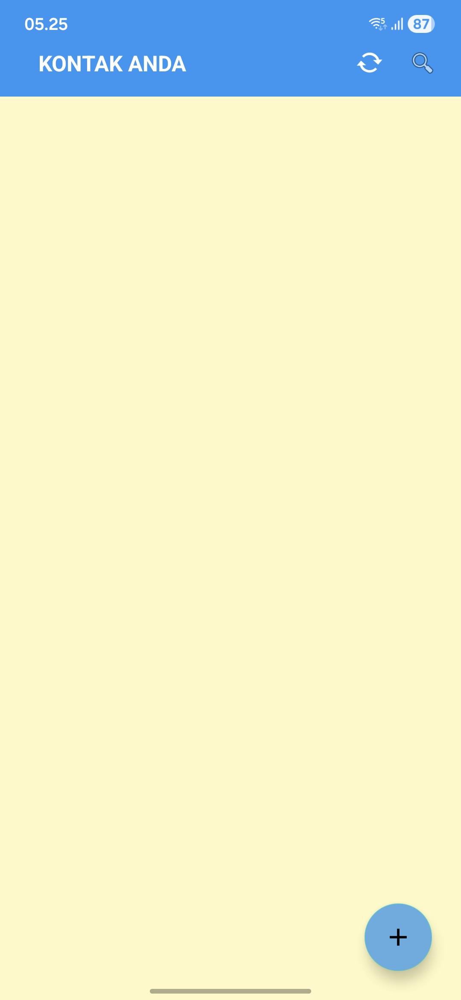
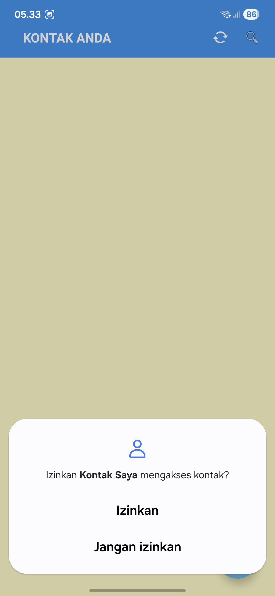
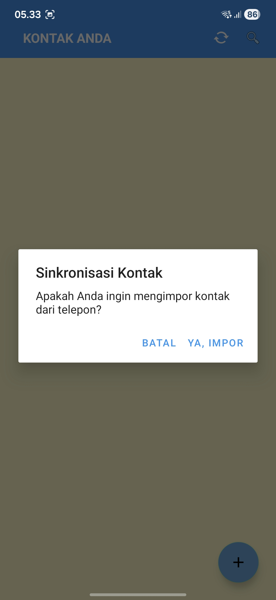
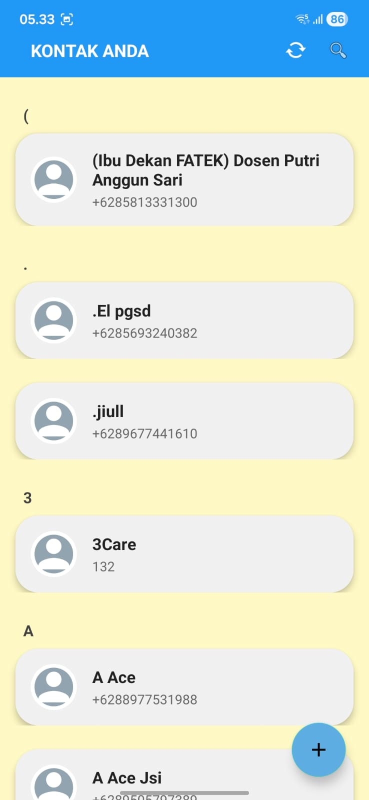
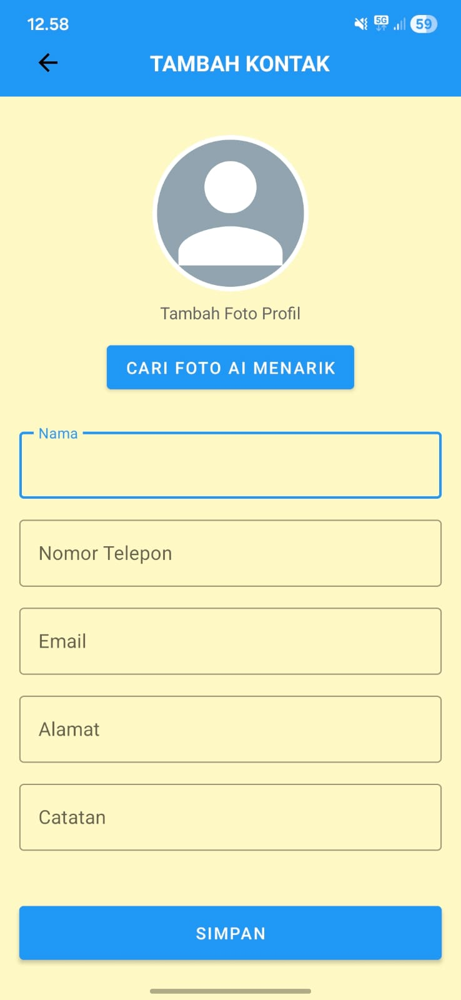
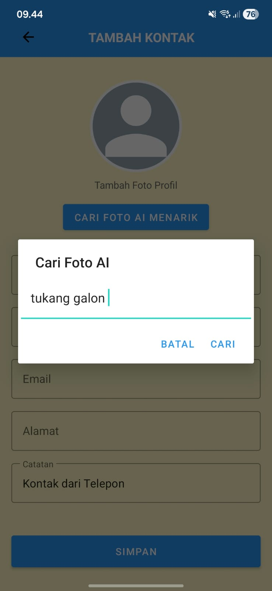
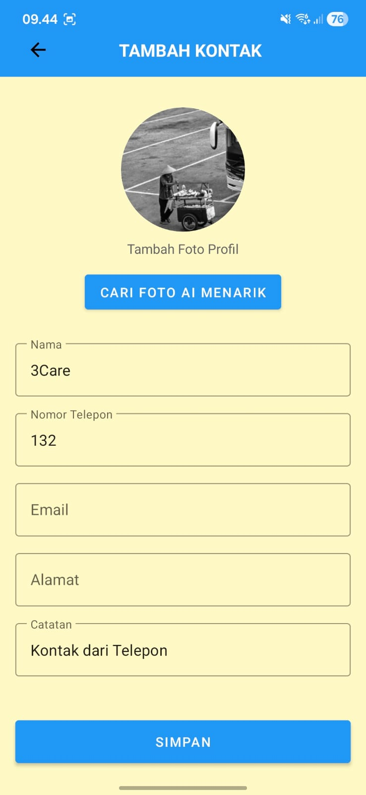
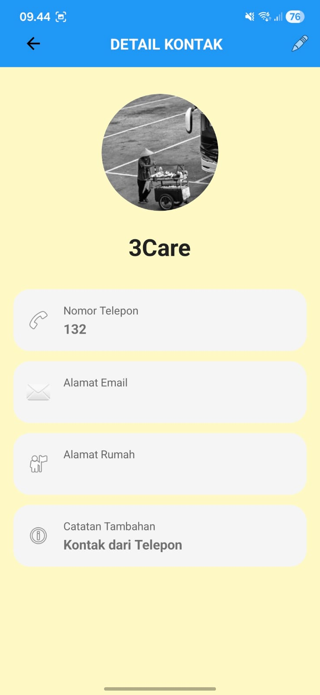

# KontakApp: Aplikasi Manajemen Kontak Modern Terintegrasi AI

KontakApp adalah aplikasi Android inovatif untuk manajemen kontak yang dirancang guna menyelesaikan masalah umum: buku telepon yang membosankan dengan foto profil yang kosong. Aplikasi ini mengintegrasikan kecerdasan buatan (melalui Pexels API) untuk mencari dan menetapkan foto profil berkualitas tinggi secara otomatis berdasarkan kata kunci.

**Dibuat oleh:** Aldi Rismandayana

---

## Fitur Unggulan

* **Manajemen Kontak Lengkap (CRUD):** Tambah, Edit, Hapus, dan cari data kontak dengan antarmuka yang sangat responsif.
* **AI Photo Search (Pexels API):** Fitur pencarian foto profil dinamis berbasis kata kunci (misal: "pria formal", "cewek aesthetic") langsung dari dalam aplikasi.
* **Smart Manual Sync:** Mengimpor kontak dari memori telepon secara manual. Dirancang dengan mengedepankan privasi pengguna melalui dialog konfirmasi dan sistem permission Android.
* **Detail & Fullscreen View:** Tampilan detail kontak yang bersih dengan kemampuan melihat foto profil dalam ukuran penuh (fullscreen).
*  **Modern UI/UX:** Menggunakan elemen Material Design 3 dengan palet warna Biru (kepercayaan) dan Kuning (kreativitas) yang nyaman dipandang.

---

## UI (User Interface)

<div align="center">
  
  
  
   
  
  
  
  
   
  
</div>

---

## Teknologi & Arsitektur (Tech Stack)

Aplikasi ini dibangun menggunakan pendekatan *native* untuk memastikan performa yang optimal:

* **Bahasa Pemrograman:** Java (Android SDK)
* **Penyimpanan Data Lokal:** `SharedPreferences` dipadukan dengan library `GSON`. Data kontak di-encode menjadi format JSON yang sangat ringan dan cepat diakses tanpa beban database relasional.
* **Networking & API:** `HttpURLConnection` / Android Networking untuk mengambil data dari Pexels API.
* **Image Processing:** **Glide** untuk memuat gambar dari URL secara asinkron, melakukan *caching*, dan mencegah memori lag saat *scrolling*.
* **UI Components:** `RecyclerView`, `FloatingActionButton`, Material Components.

---

## Tantangan Teknis & Solusi

| Tantangan / Masalah | Solusi yang Diterapkan |
| :--- | :--- |
| **UX Terganggu Keyboard:** Toolbar dan antarmuka berantakan/terdorong keluar layar saat virtual keyboard muncul. | Implementasi pengaturan *Window Soft Input Mode* dan penggunaan struktur `RelativeLayout` yang presisi sebagai penyangga Status Bar. |
| **Privasi Data Pengguna:** Kekhawatiran pengguna jika aplikasi menyinkronkan data kontak HP secara otomatis tanpa izin. | Mengubah alur menjadi **Manual Sync**. Sistem dirombak untuk hanya membaca data setelah pengguna menekan tombol *Sync* dan menyetujui dialog konfirmasi. |
| **Performa Gambar:** Menampilkan banyak gambar HD dari API membuat *list* menjadi *lagging*. | Implementasi library **Glide** yang secara otomatis melakukan kompresi dan *caching* gambar ke memori lokal. |

---

##  Cara Menjalankan Aplikasi (Instalasi)

1. Pastikan Anda telah menginstal Android Studio.
2. *Clone* repositori ini ke komputer Anda melalui terminal/CMD:
   ```bash
   git clone [https://github.com/username-anda/KontakApp.git](https://github.com/username-anda/KontakApp.git)
